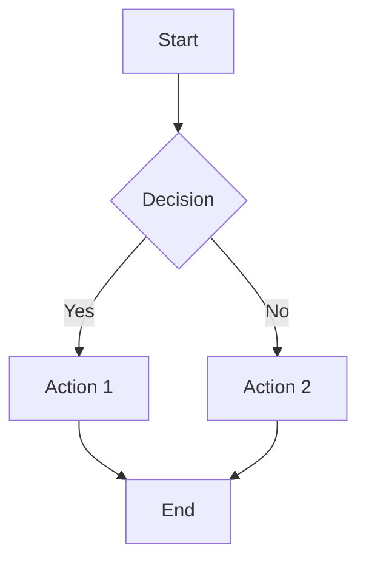
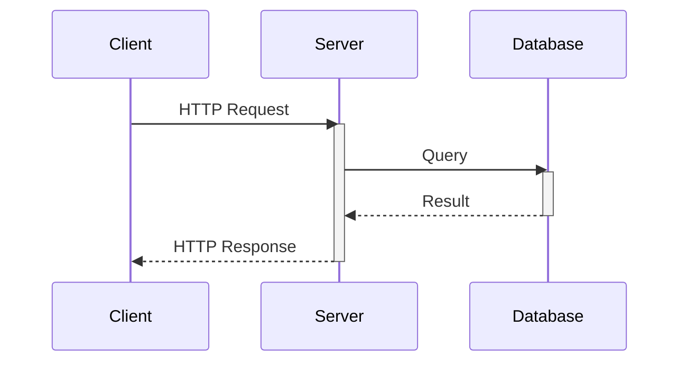
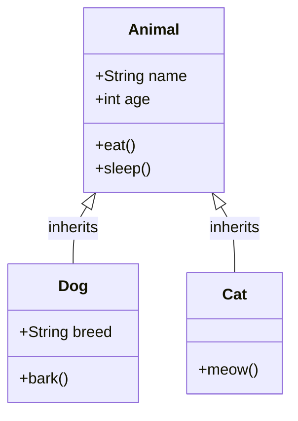
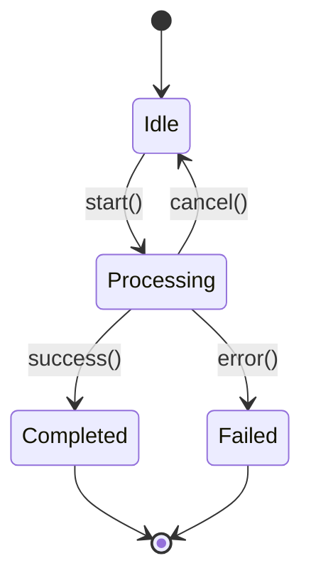
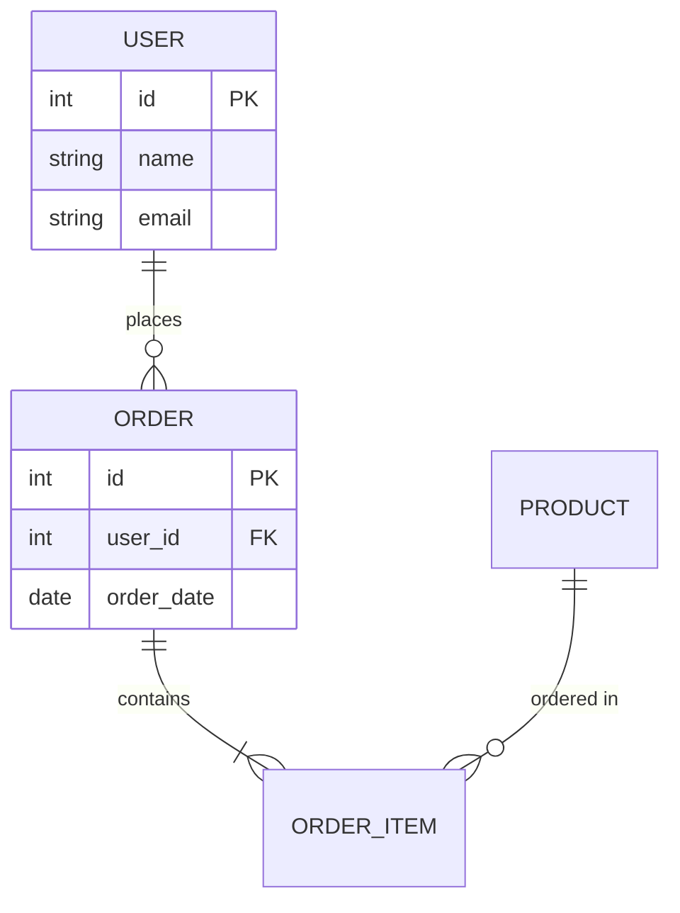
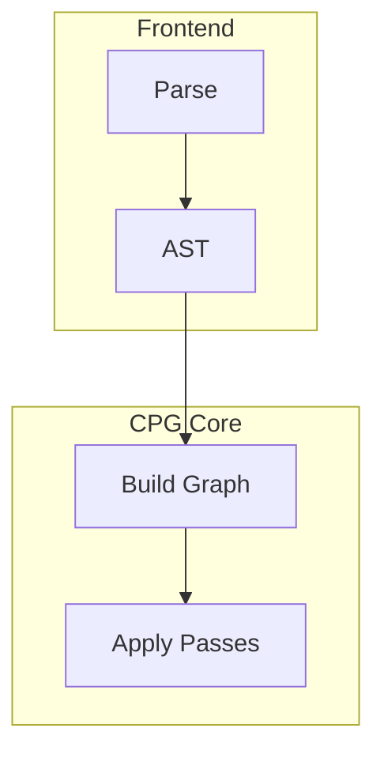
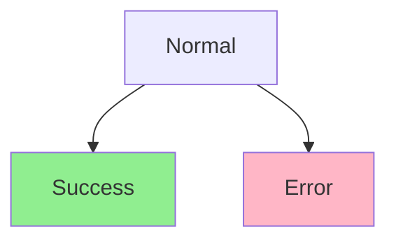
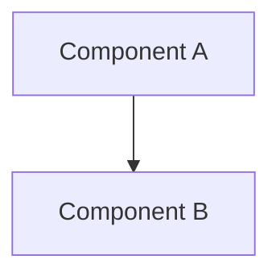

# Mermaid Diagram Syntax and Best Practices

## Why this knowledge exists

Mermaid is a universal diagramming tool for technical documentation. This knowledge is pre-loaded into the memory system as **system knowledge** so any project can leverage it without re-learning.

**Nature**: System tool knowledge (project-agnostic)

---

## Core Concept

Mermaid allows creating diagrams using text-based syntax embedded in Markdown code blocks.

**Basic Syntax**:
```markdown
\```mermaid
<diagram-type>
  <diagram-content>
\```
```

**Key Benefits**:
- ✅ Text-based (version control friendly)
- ✅ Renders in Markdown viewers (GitHub, GitLab, etc.)
- ✅ Easy to update (no external tools needed)
- ✅ Consistent styling

---

## Supported Diagram Types

### 1. Flowchart (Process Flow)

**Purpose**: Algorithms, decision trees, process flows, build pipelines

**Syntax**:


**Direction Options**:
- `TD` / `TB`: Top-Down / Top-Bottom (vertical)
- `LR`: Left-Right (horizontal)
- `RL`: Right-Left
- `BT`: Bottom-Top

**Node Shapes**:
- `[Text]`: Rectangle (process/action)
- `{Text}`: Diamond (decision)
- `([Text])`: Stadium (start/end)
- `[[Text]]`: Subroutine
- `[(Text)]`: Cylinder (database)
- `((Text))`: Circle

**Best Use Cases**:
- Algorithm flow
- Build/deployment pipelines
- Decision logic
- State transitions (simple)

---

### 2. Sequence Diagram (Interactions)

**Purpose**: API calls, message passing, interaction flows, protocol exchanges

**Syntax**:


**Arrow Types**:
- `->>`: Solid arrow (synchronous call)
- `-->>`: Dashed arrow (response/return)
- `-x`: Solid arrow with X (lost message)
- `--x`: Dashed arrow with X

**Activation**:
- `activate <participant>`: Show participant is processing
- `deactivate <participant>`: Processing complete

**Best Use Cases**:
- API interaction flows
- Protocol message exchanges
- Multi-component communication
- End-to-end request flows

---

### 3. Class Diagram (Architecture)

**Purpose**: Object-oriented architecture, type systems, component relationships

**Syntax**:


**Relationship Types**:
- `<|--`: Inheritance (is-a)
- `*--`: Composition (has-a, strong)
- `o--`: Aggregation (has-a, weak)
- `-->`: Association
- `..>`: Dependency
- `..|>`: Interface implementation

**Visibility**:
- `+`: Public
- `-`: Private
- `#`: Protected
- `~`: Package

**Best Use Cases**:
- Class hierarchy
- Component architecture
- Type system design
- Interface contracts

---

### 4. State Diagram (State Machines)

**Purpose**: State machines, lifecycle, status transitions

**Syntax**:


**Special States**:
- `[*]`: Start/end state
- `state "Long Name" as S1`: Named state with alias

**Best Use Cases**:
- Object lifecycle
- Workflow states
- Protocol states
- Process status

---

### 5. Entity Relationship Diagram (Data Models)

**Purpose**: Database schema, data relationships

**Syntax**:


**Cardinality**:
- `||--||`: One-to-one
- `||--o{`: One-to-many
- `}o--o{`: Many-to-many

**Best Use Cases**:
- Database schema
- Data model design
- Entity relationships

---

## Best Practices

### 1. Choose Appropriate Diagram Type

| Use Case | Diagram Type | Why |
|----------|--------------|-----|
| Algorithm flow | Flowchart | Shows step-by-step logic |
| API interactions | Sequence | Shows message passing over time |
| Component structure | Class | Shows relationships and hierarchy |
| Lifecycle/workflow | State | Shows status transitions |
| Data model | ER Diagram | Shows entity relationships |

### 2. Keep Diagrams Simple

**Rule of Thumb**: Max 10-15 nodes per diagram

**Why**: Diagrams with >20 nodes become hard to read

**Solution**: Split complex diagrams:
```markdown
## Overall Architecture (High-Level)
\```mermaid
flowchart TD
    A[Component A] --> B[Component B]
    B --> C[Component C]
\```

## Component B Details (Zoomed In)
\```mermaid
flowchart TD
    B1[Sub-component 1] --> B2[Sub-component 2]
    B2 --> B3[Sub-component 3]
\```
```

### 3. Use Meaningful Labels

**Good**:
- Nodes: Concise (1-4 words): `Parse AST`, `Build CPG`, `Apply Pass`
- Edges: Describe relationship: `generates`, `extends`, `calls`

**Bad**:
- Too verbose: `This component parses the abstract syntax tree`
- Too vague: `Process`, `Thing`, `Data`

### 4. Consistent Styling

**Direction**: Use TD (top-down) or LR (left-right) consistently within a document

**Node Shapes**: Use same shape for same concept type:
- Rectangles for processes/actions
- Diamonds for decisions
- Cylinders for data stores

### 5. Add Context with Captions

Always add a caption/description after the diagram:

```markdown
\```mermaid
flowchart TD
    A[Source Code] --> B[Frontend Parse]
    B --> C[CPG Build]
\```

**Figure 1**: CPG construction pipeline. Source code is parsed by the frontend,
then the CPG is built by layering AST, CFG, DFG, and applying passes.
```

---

## Common Pitfalls

### ❌ Pitfall 1: Diagram Too Complex

**Problem**: 30+ nodes in one diagram

**Solution**: Split into multiple diagrams (high-level overview + detailed views)

### ❌ Pitfall 2: Wrong Diagram Type

**Problem**: Using flowchart for interactions (should use sequence diagram)

**Solution**:
- Interactions over time → Sequence diagram
- Step-by-step logic → Flowchart

### ❌ Pitfall 3: Missing Context

**Problem**: Diagram without explanation

**Solution**: Always add caption explaining what the diagram shows

### ❌ Pitfall 4: Inconsistent Styling

**Problem**: Mixing TD and LR directions in same document

**Solution**: Pick one direction and stick to it (usually TD for processes)

### ❌ Pitfall 5: Unclear Labels

**Problem**: Generic labels like "Step 1", "Process A"

**Solution**: Use domain-specific terms: "Parse Java AST", "Build EOG"

---

## Advanced Features

### Subgraphs (Grouping)



### Styling



### Links (Clickable)



---

## Quick Reference

### Flowchart Syntax
```
flowchart TD
    A[Rectangle] --> B{Diamond}
    B -->|Label| C([Stadium])
    C --> D[(Cylinder)]
```

### Sequence Diagram Syntax
```
sequenceDiagram
    A->>B: Call
    activate B
    B-->>A: Response
    deactivate B
```

### Class Diagram Syntax
```
classDiagram
    class Animal {
        +name: String
        +eat()
    }
    Animal <|-- Dog
```

### State Diagram Syntax
```
stateDiagram-v2
    [*] --> State1
    State1 --> State2 : event
    State2 --> [*]
```

---

## Cross-References

- **[sys-tool-002](./markdown-best-practices.md)**: How to embed diagrams in documentation
- **Related project notes**: Any project-specific semantic notes can reference this for diagram conventions

---

## Usage in Projects

When working on any project:

1. **Query this note**: Search for "mermaid" or "diagram" in memory index
2. **Reference in project notes**: Link to `sys-tool-001` when using Mermaid
3. **Follow best practices**: Keep diagrams simple, use appropriate types
4. **Don't duplicate**: Don't create project-specific Mermaid notes unless adding project-specific conventions

---

**Status**: System knowledge (stable, project-agnostic)
**Maintenance**: Update only when Mermaid syntax changes or best practices evolve
